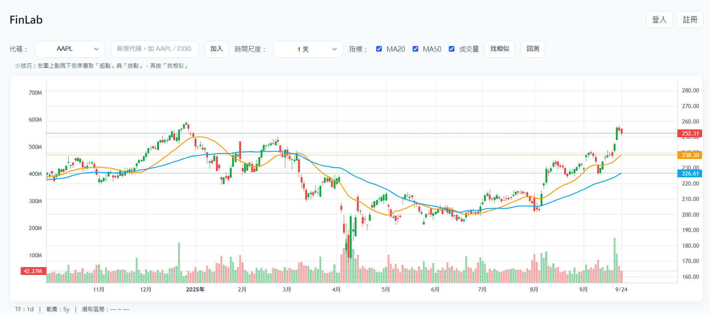
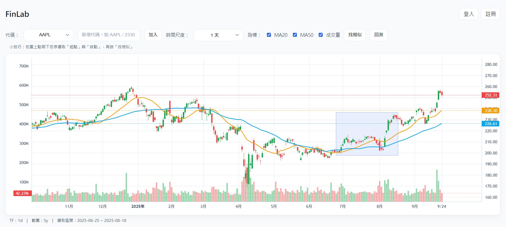
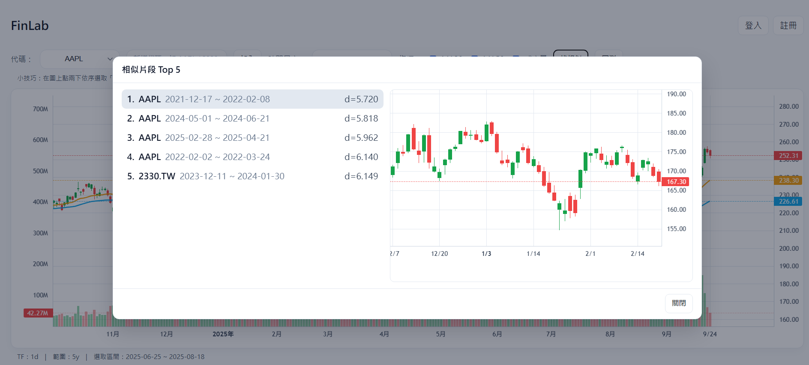
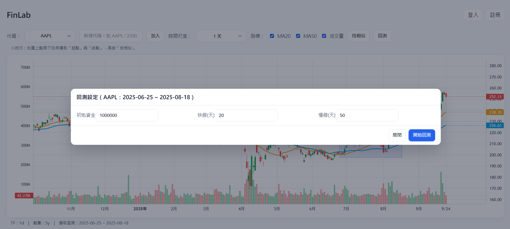
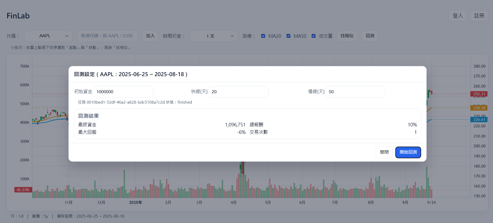
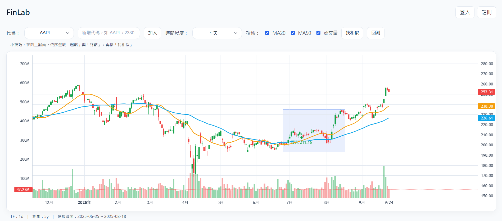
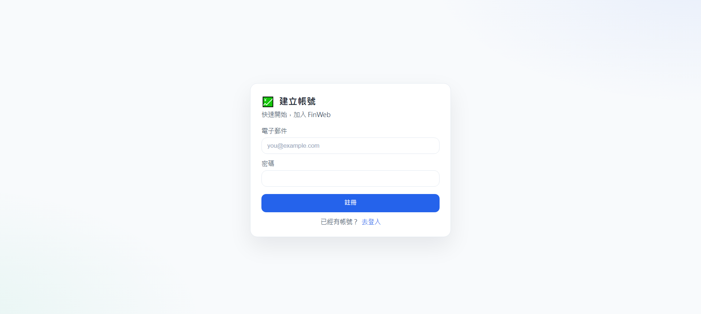
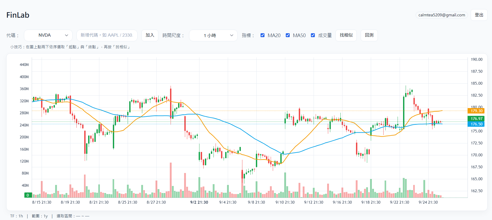

# FinWeb

- 前端: Next.js (App Router, TypeScript) + lightweight-charts
  - 顯示 K 線、MA、成交量、相似片段、簡易回測操作 UI。
- 後端: FastAPI + SQLAlchemy + TimescaleDB / PostgreSQL
  - 提供技術指標、相似片段搜尋、帳號/偏好、以及使用 SMA 回測。

## 功能總覽
- K線圖 + 指標: MA20、MA50、成交量，可切換時間尺度 (5m/15m/1h/1d)。
- 即時資料: 透過 Yahoo Finance v8 Chart API 取得。
- 相似片段搜尋: 對選取區間做 z-normalized 距離掃描，找 Top 5 的類似股票區間走勢。
- 帳號與偏好: 註冊、登入，儲存使用者的代碼清單與指標選擇。
- 回測: 簡易 SMA Cross (金叉/死叉) 回測，提交任務到 RQ/Redis，完成後回傳報表與標記進出場點。

## 前端操作重點
- 左上角選「代碼」「時間尺度」，可用輸入框新增代碼 (如`AAPL`、`NVDA`)。
- 在圖上點兩下依序選取「起點」「終點」後，可按「找相似」或「回測」。
- 指標勾選可顯示 MA20 / MA50 / 成交量
- 登入後會將偏好會同步到後端。

## 網站

**網站首頁**

**選取區間片段**

**相似片段查詢**

**回測設定**

**回測結果**

**回測結果 (買賣點)**

**登入頁面**

**登入後網站樣貌**

